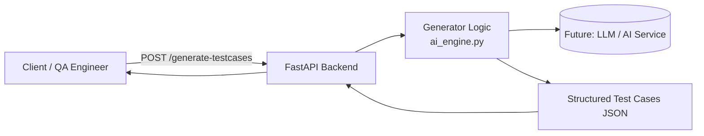

# 🧪 AI-Powered Test Case Generator (LLM-ready QA Tool)

This project is an **AI-ready test case generator** for QA & Test Engineers.  
You send a **requirement / user story**, and the API returns **structured test cases**.

Right now it uses a **deterministic demo generator** (no external API key needed).  
Later it can be extended with a real LLM (OpenAI, local model, etc.).

---

## 🚀 Features

- REST API built with **FastAPI**
- Endpoint to generate structured test cases:
  - Title
  - Preconditions
  - Steps
  - Expected result
  - Priority
  - Tags
- Fully tested with **pytest**:
  - Unit tests for generator
  - API tests using FastAPI TestClient
- Clean, extensible architecture (`src/` package)
- Ready for CI/CD integration (GitHub Actions, Docker)

---

## 🧱 Architecture

📂 Project Structure

ai-testcase-generator/
├── src/
│   ├── __init__.py
│   ├── main.py          # FastAPI app & endpoints
│   ├── ai_engine.py     # Core test case generator (LLM-ready)
│   └── models.py        # Pydantic models (request/response)
├── tests/
│   ├── test_ai_engine.py
│   └── test_api.py
├── README.md
├── requirements.txt
├── Dockerfile           # (optional, future use)
├── .gitignore
└── .github/
    └── workflows/
        └── ci.yml       # (optional, future use)

🛠️ Tech Stack

-Language: Python 3.11+

-Framework: FastAPI

-Testing: pytest

-HTTP Client for tests: httpx (via FastAPI TestClient)

🔧 Local Setup

# 1. Clone repository
git clone https://github.com/<your-username>/ai-testcase-generator.git
cd ai-testcase-generator

# 2. Create virtual environment
python -m venv .venv
source .venv/bin/activate  # On Windows: .venv\Scripts\activate

# 3. Install dependencies
pip install -r requirements.txt

▶️ Run the API

uvicorn src.main:app --reload

Then open:

Swagger UI: http://127.0.0.1:8000/docs

Health check: http://127.0.0.1:8000/

Example request (POST /generate-testcases):

{
  "requirement_text": "As a user, I want to add items to my shopping cart so that I can buy multiple products in one order.",
  "num_cases": 3,
  "style": "plain"
}

🧪 Running Tests

pytest -v

You should see all tests passing ✅

📌 Future Ideas

Plug in a real LLM (OpenAI, local model, etc.)

Generate multiple test cases based on num_cases

Add support for:

Gherkin output

Export to CSV / Jira / Xray

Add Docker + CI/CD pipeline that runs tests on every push
